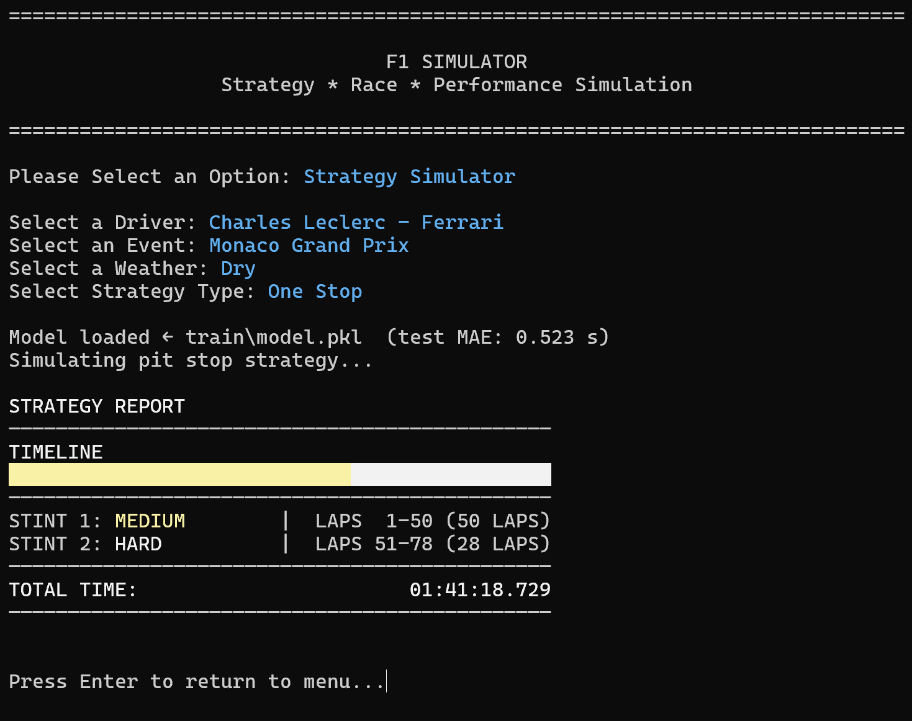

# F1 Simulator

An end-to-end Formula 1 data and strategy pipeline that:

1. **Extracts lap-by-lap race data** from FastF1.
2. **Trains a LightGBM model** to predict lap times.
3. **Simulates pit-stop strategies** from a terminal UI.



## Project structure

- `lap_data/` — FastF1-based data extraction pipeline.
- `laptime_predictor/` — model training, prediction, and evaluation tooling.
- `simulator/` — interactive strategy simulator built on top of the trained model.
- `orchestrator.py` — helper script to run the three workflows from one menu.

## Requirements

- Python **3.10+**
- A virtual environment (recommended)

Core dependencies (from `pyproject.toml`):

- `fastf1`
- `pandas`
- `numpy`
- `lightgbm`
- `scikit-learn`

## Installation

```bash
python -m venv venv
source venv/bin/activate          # Linux/macOS
# venv\Scripts\activate          # Windows PowerShell

pip install -r requirements.txt
```

Or install as a package:

```bash
pip install -e .
```

## Quick start

### 1) Collect lap data

Pull all available seasons (2018 → current):

```bash
python -m lap_data
```

Pull a single season:

```bash
python -m lap_data --year 2024
```

Pull one race by schedule index (1-based):

```bash
python -m lap_data --year 2024 --race 5
```

Output files are generated as:

- `data/all.csv`
- `data/<year>/all.csv`
- `data/<year>/races/<race_index>.csv`

### 2) Train and evaluate the model

Train:

```bash
python -m laptime_predictor train --csv data/all.csv --out train/model.pkl
```

Evaluate:

```bash
python -m laptime_predictor evaluate --csv data/all.csv --model train/model.pkl
```

Predict:

```bash
python -m laptime_predictor predict --csv data/all.csv --model train/model.pkl
```

Inspect model metadata:

```bash
python -m laptime_predictor info --model train/model.pkl
```

Run predefined demo scenarios:

```bash
python -m laptime_predictor demo --model train/model.pkl
```

### 3) Run strategy simulation UI

```bash
python -m simulator
```

You can choose a driver, event, weather, and strategy type (one-stop/two-stop), and the simulator searches for the best stint plan using predicted lap times.

## CLI entry points

If installed via package scripts, these commands are available:

```bash
lap-data
laptime-predict
simulator
```

## One-menu workflow (optional)

The project includes `orchestrator.py`, which launches an interactive job selector:

```bash
python orchestrator.py
```

> Note: `orchestrator.py` expects a local `venv/` with a Python executable inside it.

## Notes

- FastF1 cache is stored under `cache/`.
- Default training data path: `data/all.csv`.
- Default model path: `train/model.pkl`.

## License

This project is licensed under the MIT License. See `LICENSE`.

## Contact Information

| Name           | Phone Number      | Email               | LinkedIn                                    |
|----------------|-------------------|---------------------|---------------------------------------------|
| Andria Beridze | +1 (267) 632-6754 | andria24b@gmail.com | [linkedin.com/in/andriaberidze](https://www.linkedin.com/in/andriaberidze/) |